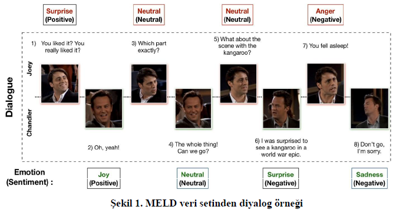
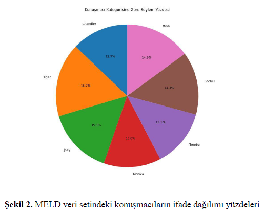
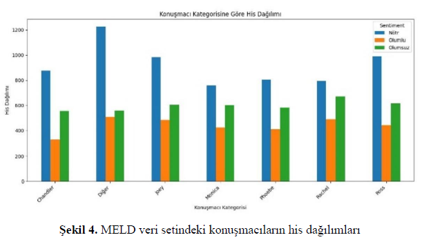
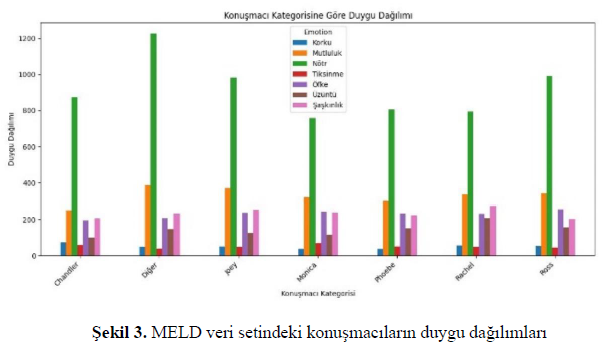
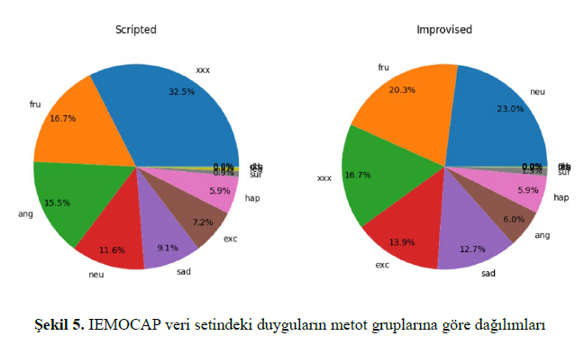

# Bitirme Projesi - Multimodüler Duygu Analizi ile Yapay Sinir Ağları
**Öğrenciler**: Rabia Şevval Aydın, Sude Nur Tungaç

**Danışman**: Doç. Dr. Ayşe Berna Altınel

**Tarih**: Haziran 2025

---

## Proje Hakkında
Bu proje, diyalog verileri üzerinde duygu analizini
Bu proje, diyalog verileri üzerinde duygu analizi görevini gerçekleştiren yapay sinir ağlarının performanslarının değerlendirilerek; metin, ses ve görüntü modaliteleri için optimal yöntemlerin belirlenmesini hedefler. 

**### Kullanılan Veri Setleri**
**MELD-Multimodal Emotion Lines Dateset**
- 'Friends' televizyon dizisinden toplanmış 1433 diyaloga ait 13000'den fazla ifadeden oluşur.
- İkiden fazla kişinin yer aldığı diyalogları içerir.
- Her bir ifade için pozitif, negatif ve nötr olmak üzere 3 duygu sınıfı bulunur.
- Her bir ifade için sinir, tiksinti, üzüntü, mutluluk, korku, nötr, şaşkınlık olmak üzere 7 duygu etiketi bulunur.
- Aşağıda sırasıyla MELD veri setinden örnek bir diyalog, veri setindeki konuşmacıların duygu dağılım grafiği, konuşmacı his dağılımı ve konuşmacıların ifade dağılım yüzdesi bulunmaktadır.










**IEMOCAP-Interactive Emotional Dyadic Motion Capture**
- 5 erkek ve 5 kadından oluşan bir gruba ait ikili diyalog çiftlerinii içerir.
- 151 diyalog, 302 video kaydından toplamda 10039 veri örneği sunar.
- Senaryoya bağlı ya da doğaçlama diyaloglar içerir.
- Her bir ifade için sinir, heyecan, korku, üzüntü, şaşkınlık, mutluluk, memnuniyetsizlik, hayal kırıklığı ve nötr olmak üzere 9 duygu etiketi bulunur.




**Kullanılan Ana Modeller**
- bcLSTM
- DialogueRNN, RoBERTa + DialogueRNN
- COSMIC
---
## 📂 Proje Repo Yapısı
```
bitirme-tezi/
│── base-model/            
│── COSMIC/                
│── DialogueRNN/           
│── RoBERTa/               
│── .gitignore             # İstenmeyen dosyaları git takibinden çıkarmak için
```
---
## Sonuçlar
**---bcLSTM Modelinin MELD veri seti üzerinde duygu analizinde sınıflara ait f1-skorları ve doğruluk değerleri---**
| Modeller / Duygular           | nötr   | şaşkınlık | korku | üzüntü | sevinç | tiksinti | sinir | doğruluk |
|-------------------------------|--------|-----------|-------|--------|--------|----------|-------|----------|
| Base model text               | 0.6498 | 0.00      | 0.00  | 0.00   | 0.00   | 0.00     | 0.00  | 0.4812   |
| Base model audio              | 0.4578 | 0.00      | 0.00  | 0.00   | 0.00   | 0.00     | 0.00  | 0.3390   |
| Bimodel base text+audio       | 0.6518 | 0.0137    | 0.00  | 0.00   | 0.1240 | 0.00     | 0.272 | 0.4816   |


**---MELD ve IEMOCAP veri setinde DialogueRNN ve COSMIC modellerinin duygu sınıflandırmasına ait f1-skor değerleri---**

| Modeller / Veri Setleri      | MELD text | MELD audio | MELD multimodal | IEMOCAP |
|-------------------------------|-----------|------------|-----------------|---------|
| DialogueRNN                   | 57.27     | 43.24      | 57.68           | 60.60   |
| RoBERTa + DialogueRNN         | 47.10     | 47.47      | 50.40           | –       |
| RoBERTa + COSMIC              | 64.36     | –          | –               | 66.34   |

---
# COSMIC: COmmonSense knowledge for eMotion Identification in Conversations

## Çalıştırma
Öncelikle RoBERTa ve COMET özelliklerini [buradan](https://drive.google.com/file/d/1TQYQYCoPtdXN2rQ1mR2jisjUztmOzfZr/view) indirin ve bunları COSMIC/erc-training'de uygun dizinlerde saklayın. Daha sonra iki veri kümesi üzerinde eğitim ve değerlendirme şu şekilde yapılacaktır:
```bash
python train_iemocap.py --active-listener
python train_meld.py --active-listener --attention simple --dropout 0.5 --rec_dropout 0.3 --lr 0.0001 --mode1 2 --classify emotion --mu 0 --l2 0.00003 --epochs 60
```
---
# DialogueRNN: An Attentive RNN for Emotion Detection in Conversations

## Gereklilikler
- Python 3
- PyTorch 1.0
- Pandas 0.23
- Scikit-Learn 0.20
- TensorFlow (isteğe bağlı)
- tensorboardX (isteğe bağlı)

## Veri Seti Özellikleri
Lütfen DialogueRNN_features.zip'in içeriğini çıkarın.

## Çalıştırma
```bash
python train_IEMOCAP.py 
python train_MELD.py
```
---
# RoBERTa
RoBERta modelini eğitmek için önce önceden eğitilmiş ağırlıkları [buradan](https://drive.google.com/file/d/1TQYQYCoPtdXN2rQ1mR2jisjUztmOzfZr/view) indirin ve roberta-large/'nin bu dizine yerleştirilmesi için tar dosyasını açın. Ardından, IEMOCAP veri kümesi için bağlamdan bağımsız özellik vektörlerini aşağıdaki gibi ön işleyebilir, eğitebilir ve ayıklayabilirsiniz:

```bash
python roberta_init_meld.py
python roberta_preprocess_meld.sh
python roberta_train_meld.sh
python roberta_feature_extract_meld.py
```

Elde edilen özellik vektörlerinin boyutlarını düşürmek ve DialogueRNN ile uyumlu hale getirmek için:
```bash
python dimensionality_reduction.py
```

